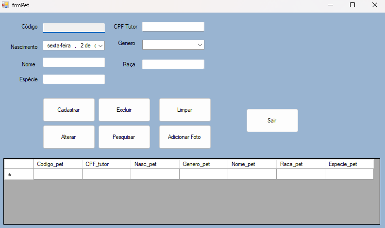
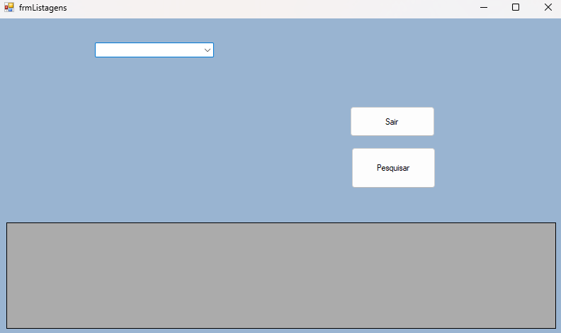
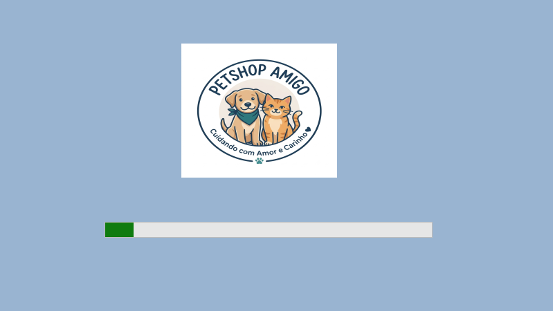
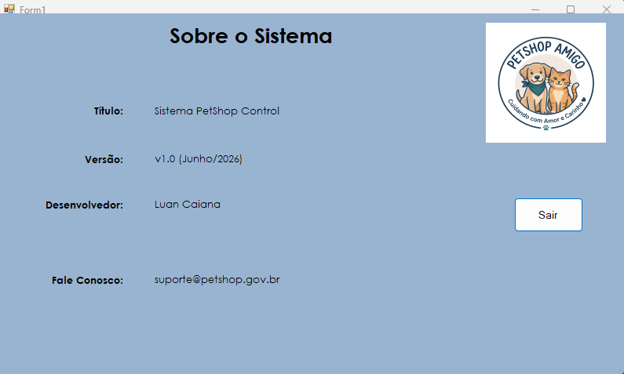
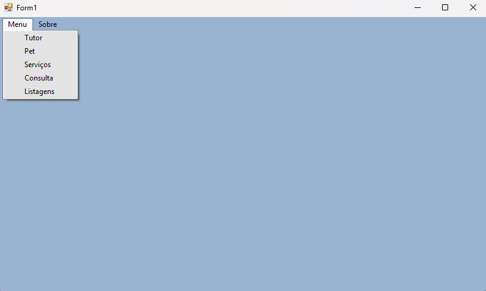
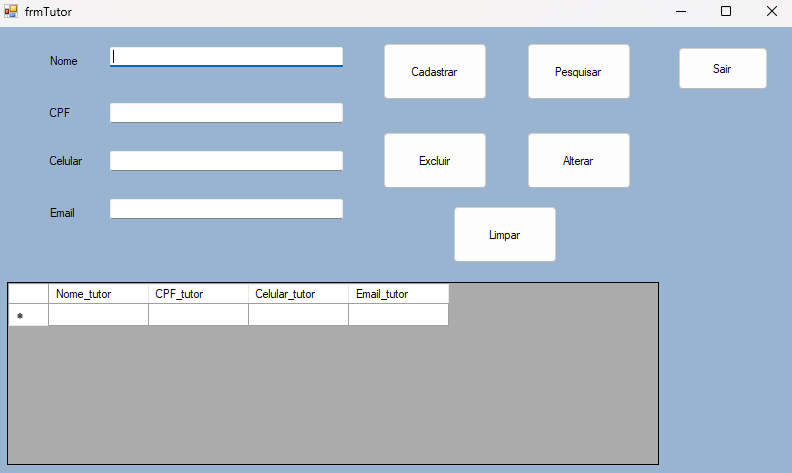
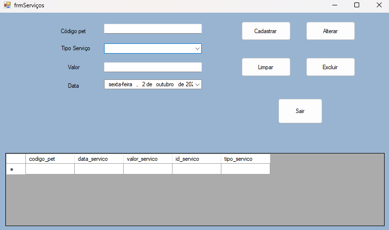
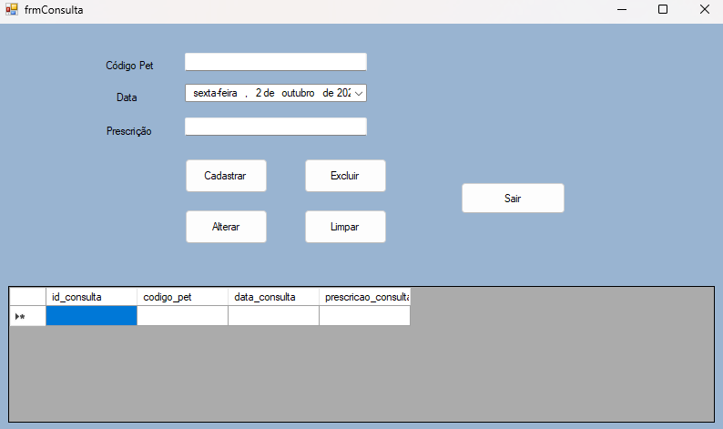

# 🐾 Projeto PetShop - Gerenciamento de Clientes e Pets


## 📝 Descrição

Aplicação desktop desenvolvida em C# (.NET Framework 4.7.2) para otimizar o gerenciamento de pets e seus respectivos tutores em um estabelecimento como um pet shop. Este sistema oferece uma interface intuitiva em Windows Forms, facilitando o cadastro, a consulta e a manutenção das informações dos animais e seus proprietários.

## ✨ Funcionalidades Principais

*   Cadastro completo de pets (com vínculo ao CPF do tutor).

*   Listagem e pesquisa de pets por diversos critérios.

*   Edição e exclusão de registros existentes.

*   Armazenamento de fotos dos pets para um perfil visual completo.

*   Pesquisa utilizando um double click no item desejado (usuário, pet, serviço, etc)

## 🚀 Demonstração (Screenshots/GIFs)

### Tela de Cadastro de Pets


### Tela de Listagem de Pets


### Tela Splash


### Tela Sobre


### Tela Home


### Tela de Cadastro de Tutores


### Tela Serviço


### Tela Consulta



## 🛠️ Tecnologias Utilizadas

*   **Linguagem:** C# 7.3

*   **Plataforma:** .NET Framework 4.7.2

*   **Interface Gráfica:** Windows Forms

*   **Banco de Dados:** MySQL

*   **Conector:** MySql.Data

*   **Controle de Versão:** Git / GitHub


## ⚙️ Pré-requisitos

Para executar o projeto localmente, você precisará ter instalado:

*   **Visual Studio** (Community 2019 ou superior é recomendado)

*   **.NET Framework 4.7.2**

*   **Servidor MySQL acessível** (WAMP/XAMPP são opções comuns para desenvolvimento local)

*   **Pacote NuGet:** `MySql.Data` (geralmente restaurado automaticamente pelo Visual Studio)


## 🗄️ Configuração do Banco de Dados

Siga os passos abaixo para configurar o banco de dados MySQL para o sistema:

1.  **Crie um Banco de Dados:**
    Acesse seu servidor MySQL (via phpMyAdmin, MySQL Workbench ou linha de comando) e crie um novo banco de dados.
    *   **Sugestão de nome:** `petshop_db`
    *   Exemplo de comando SQL: `CREATE DATABASE petshop_db;`

2.  **Crie as Tabelas:**
    No banco de dados que você acabou de criar (`petshop_db`), execute o seguinte script SQL para criar as tabelas necessárias:

    ```sql
    DROP TABLE IF EXISTS `tutor`;
    CREATE TABLE IF NOT EXISTS `tutor` (
      `Nome_tutor` varchar(100) COLLATE utf8mb4_unicode_ci NOT NULL,
      `CPF_tutor` char(11) COLLATE utf8mb4_unicode_ci NOT NULL,
      `Celular_tutor` char(11) COLLATE utf8mb4_unicode_ci NOT NULL,
      `Email_tutor` varchar(100) COLLATE utf8mb4_unicode_ci NOT NULL,
      PRIMARY KEY (`CPF_tutor`),
      UNIQUE KEY `Celular_tutor` (`Celular_tutor`),
      UNIQUE KEY `Email_tutor` (`Email_tutor`)
    ) ENGINE=InnoDB DEFAULT CHARSET=utf8mb4 COLLATE=utf8mb4_unicode_ci;

    
    DROP TABLE IF EXISTS `pet`;
    CREATE TABLE IF NOT EXISTS `pet` (
      `Codigo_pet` int NOT NULL AUTO_INCREMENT,
      `CPF_tutor` char(11) COLLATE utf8mb4_unicode_ci NOT NULL,
      `Nasc_pet` date DEFAULT NULL,
      `Genero_pet` varchar(10) COLLATE utf8mb4_unicode_ci NOT NULL,
      `Nome_pet` varchar(100) COLLATE utf8mb4_unicode_ci NOT NULL,
      `Raca_pet` varchar(100) COLLATE utf8mb4_unicode_ci NOT NULL,
      `Especie_pet` varchar(100) COLLATE utf8mb4_unicode_ci NOT NULL,
      `Foto_pet` blob,
      PRIMARY KEY (`Codigo_pet`),
      KEY `fk_pet_tutor` (`CPF_tutor`),
      -- CHAVE ESTRANGEIRA COM O TUTOR
      CONSTRAINT `fk_pet_tutor` FOREIGN KEY (`CPF_tutor`) REFERENCES `tutor` (`CPF_tutor`) ON DELETE CASCADE ON UPDATE CASCADE
    ) ENGINE=InnoDB DEFAULT CHARSET=utf8mb4 COLLATE=utf8mb4_0900_ai_ci;

    DROP TABLE IF EXISTS `servicos`;
    CREATE TABLE IF NOT EXISTS `servicos` (
      `codigo_pet` int NOT NULL,
      `data_servico` datetime NOT NULL,
      `valor_servico` decimal(10,2) NOT NULL,
      `id_servico` int NOT NULL AUTO_INCREMENT,
      `tipo_servico` varchar(100) NOT NULL,
      PRIMARY KEY (`id_servico`),
      KEY `codigo_pet` (`codigo_pet`),
      -- CHAVE ESTRANGEIRA COM O PET
      CONSTRAINT `fk_servicos_pets` FOREIGN KEY (`codigo_pet`) REFERENCES `pet` (`Codigo_pet`) ON DELETE CASCADE ON UPDATE CASCADE
    ) ENGINE=InnoDB AUTO_INCREMENT=5 DEFAULT CHARSET=utf8mb4 COLLATE=utf8mb4_0900_ai_ci;

    DROP TABLE IF EXISTS `consulta`;
    CREATE TABLE IF NOT EXISTS `consulta` (
      `id_consulta` int NOT NULL AUTO_INCREMENT,
      `codigo_pet` int NOT NULL,
      `data_consulta` datetime NOT NULL,
      `prescricao_consulta` text NOT NULL,
      PRIMARY KEY (`id_consulta`),
      KEY `codigo_pet` (`codigo_pet`),
      CONSTRAINT `fk_consultas_pets` FOREIGN KEY (`codigo_pet`) REFERENCES `pet` (`Codigo_pet`) ON DELETE CASCADE ON UPDATE CASCADE
    ) ENGINE=InnoDB DEFAULT CHARSET=utf8mb4 COLLATE=utf8mb4_0900_ai_ci;
    ```

## 🔑 Configuração da Connection String

A connection string é lida do arquivo `App.config` do projeto. Utilize o arquivo de exemplo fornecido:

1.  No diretório raiz do projeto (onde está o arquivo `ProjetoPetShop.sln`), você encontrará o arquivo `App.config.example`.

2.  **Renomeie ou copie** `App.config.example` para `App.config`.

3.  Abra o arquivo `App.config` e localize a seção `<connectionStrings>`.

4.  **Ajuste a `connectionString`** com os detalhes do seu servidor MySQL. Para ambientes WAMP/XAMPP com usuário `root` sem senha, o exemplo abaixo é um bom ponto de partida:

    ```xml
    <connectionStrings>
        <!-- 
            Configure sua connection string aqui.
            Para desenvolvimento local com WAMP/XAMPP, 'server=localhost', 'user=root' e 'password=' (senha vazia) são comuns.
            Certifique-se de que o 'database' corresponde ao nome do banco de dados que você criou (ex: petshop_db).
        -->
        <add name="DefaultConnection" 
             connectionString="server=localhost;user=root;password=;database=petshop_db;" 
             providerName="MySql.Data.MySqlClient" />
    </connectionStrings>
    ```

## ▶️ Como Usar

1.  Abra a solução `ProjetoPetShop.sln` no Visual Studio.

2.  Restaure os pacotes NuGet se necessário (o Visual Studio geralmente faz isso automaticamente ao abrir a solução).

3.  Certifique-se de que a connection string em `App.config` está configurada corretamente (conforme o passo anterior).

4.  Compile e execute o projeto (pressione `F5` no Visual Studio).
   

## 🧠 O que Aprendi / Desafios

*   Aprofundamento em operações de CRUD (Create, Read, Update, Delete) e persistência de dados utilizando C# e MySQL.

*   Desenvolvimento de interfaces de usuário com Windows Forms, focando na usabilidade e interação do usuário.

*   Gerenciamento de dependências através do NuGet e configuração de projetos .NET.

*   Desafio de integrar a camada de UI com a camada de dados de forma eficiente, garantindo a integridade e segurança básicas das informações.

*   Aplicação de boas práticas de segurança ao lidar com credenciais de banco de dados em um ambiente de desenvolvimento.

## 🤝 Contribuição

Pull requests são bem-vindos! Sinta-se à vontade para abrir issues para relatar bugs ou sugerir melhorias.

## 📄 Licença

Este projeto está licenciado sob a Licença MIT.

## 🧑‍💻 Autor

*   **Luan Victor Caiana www.linkedin.com/in/luancaiana**
*   Lcaiana https://github.com/Lcaiana
